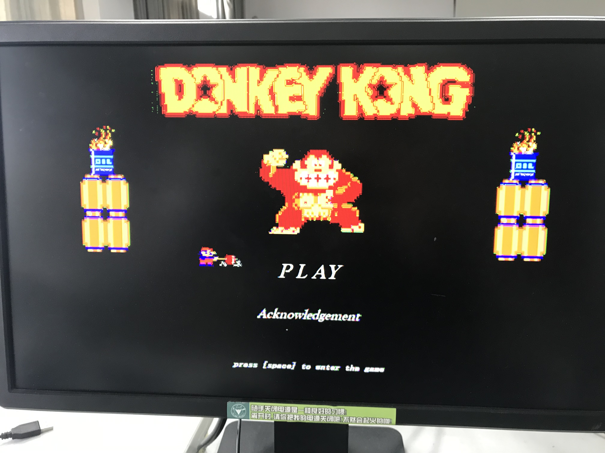
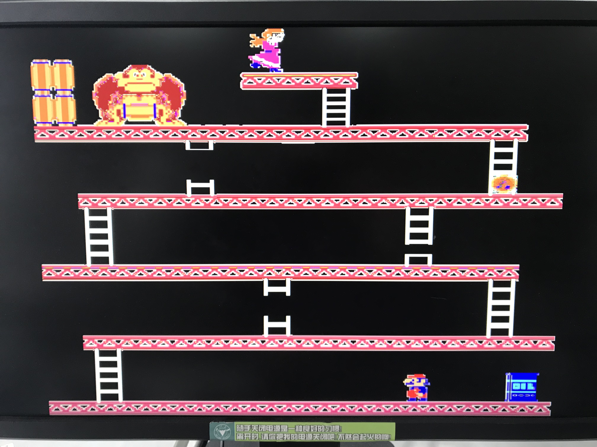
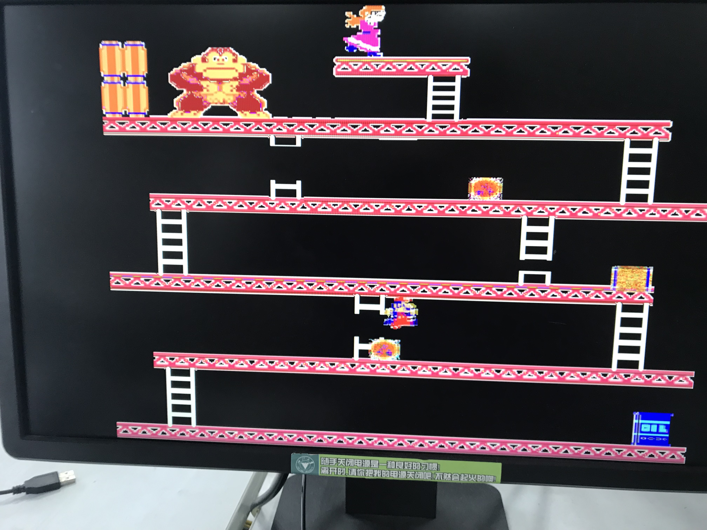
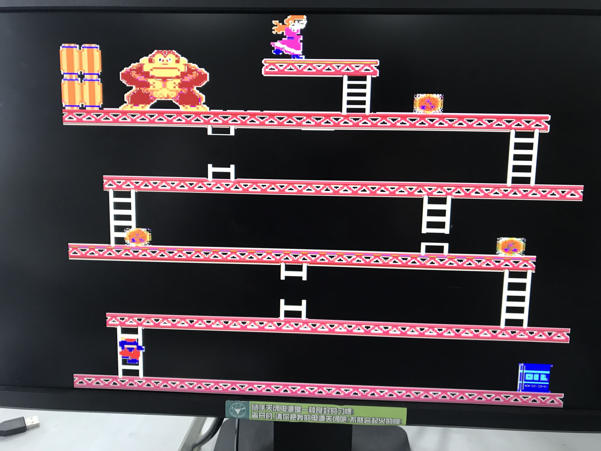
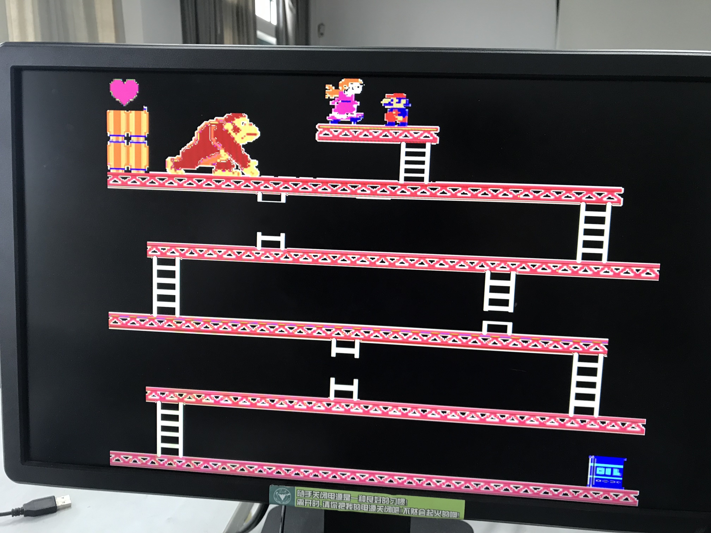

# DongKey-Kong

## Introduction

This project is a DonKeyKong like game for courses at ZJU.

Avaliable on FPGA platform.

## Example

### Start menu

### Initial scene

### Jumping

### Clamping

### Game success

## How to run
`.bit` file is provided, program the file to FPGA board with a VGA display screen and PS2 keyboard.

## Design note
[click me](note)